This project attempts to review the concepts behind [Stratified Adaptive Cluster Sampling](https://www.jstor.org/stable/2337266) while explaining several kinds of related estimators proposed by Steven K. Thompson. In the process, the concepts discussed in the reserach paper were implemented in R programming language. 

In stratified adaptive cluster sampling, the process begins by taking an initial stratified random sample from the population. After setting a specified condition, whenever a unit of the sample meets the specified condition according to its variable of interest, its nearby units are also added to the sample. This process is continuously expanded if the newly added units also meet the condition. 

Throughout this project, the unbiased estimators suitable for adaptive sampling designs are explored before applying this concept to a dataset to investigate how proposed estimators behave under different test conditions.

## Example

Let's consider the delivery patterns of truck drivers operating in Ontario and Manitoba. These drivers visit various destinations (cities), and if we focus on a specific city, it is visited multiple times over a certain period. This scenario can serve as a practical example for applying the SACS design.

To translate this example into a sampling design, we can view Ontario and Manitoba as the two strata. The cities within each province can be treated as the sampling units. For our variable of interest, we will use the number of times a city is visited by truck drivers, denoted as $y$. If $y \geq 1$, we consider that the unit has met the *condition*.

Figure 1 and Figure 2 shows the arrival patterns of truck drivers to each unit (city) of the population. The dots in Figure 1 represent the number of times that the unit has been approached by truck drivers, whereas their corresponding $y$ values are shown in Figure 2. According to these figures, it can be seen that we have $N_1 = 72$ units from *Stratum 1* and $N_2 = 72$ units from *Stratum 2* to give a total of $N = 144$.

  

    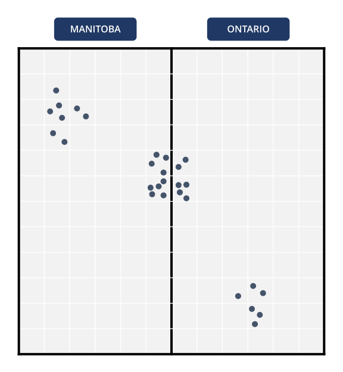
    
<strong>Figure 1:</strong> Point objects representing number of times truck drivers approached cities

  

  

    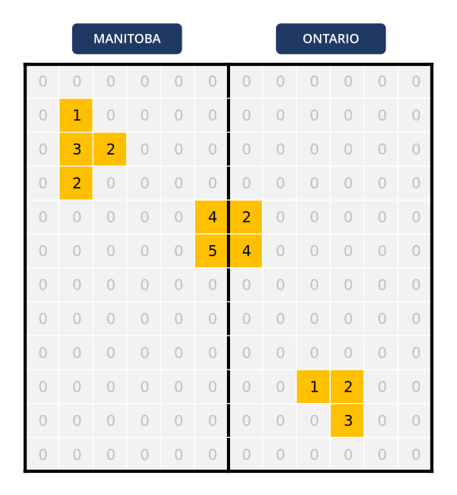
    
<strong>Figure 2:</strong> Translated <em>y</em> values representing the number of times truck drivers approached cities

  

Next, stratified random sampling can be applied to obtain the sample illustrated in Figure 1. In this scenario, four units are randomly selected from each stratum ($n_1 = 4, n_2 = 4$, with a total of $n = n_1 + n_2 = 8$). Units with $y=2 (\geq 1)$ and $y=4 (\geq 1)$ are also included in the initial sample. The selected units are highlighted in grey.

**Figure 3:** Applying stratified random sampling as the initial step

We can define the neighborhood of a unit as the units to the North, East, South, and West of the unit being considered. Next, the process of adaptive cluster sampling can be applied gradually in multiple steps, as shown in Figure 3. In the steps shown, blue cells represent the units that were newly added to the sample, and Figure 3 (j) shows the final sample after the gradual expansion process.

  

    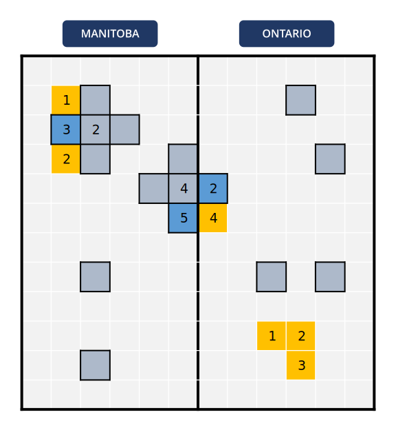
    
<strong>(a) Step 1</strong>

  

  

    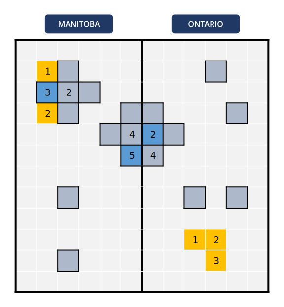
    
<strong>(b) Step 2</strong>

  

  

    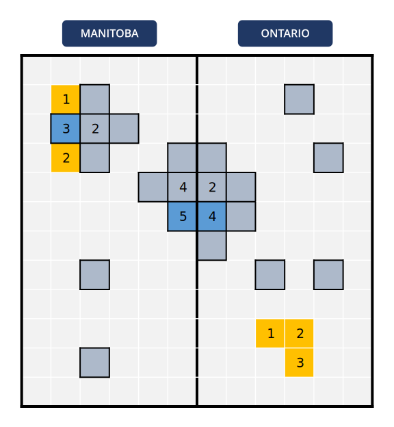
    
<strong>(c) Step 3</strong>

  

  

    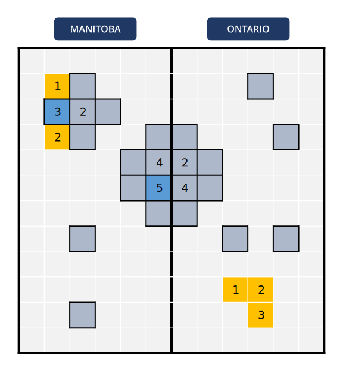
    
<strong>(d) Step 4</strong>

  

  

    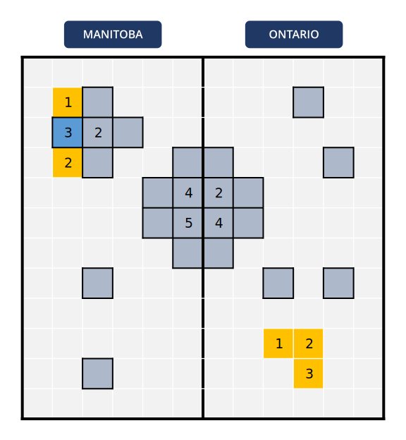
    
<strong>(e) Step 5</strong>

  

  

    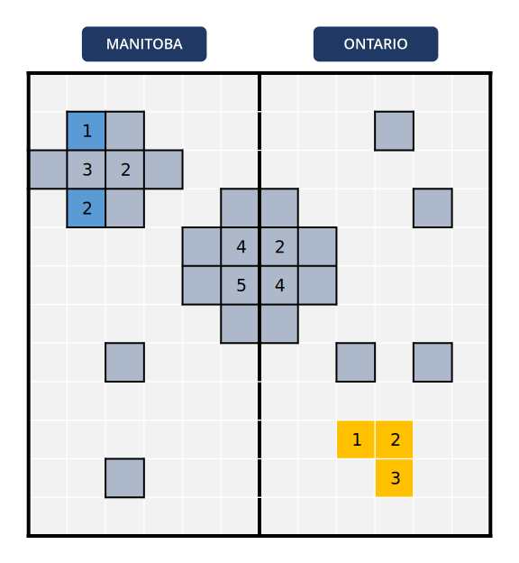
    
<strong>(f) Step 6</strong>

  

  

    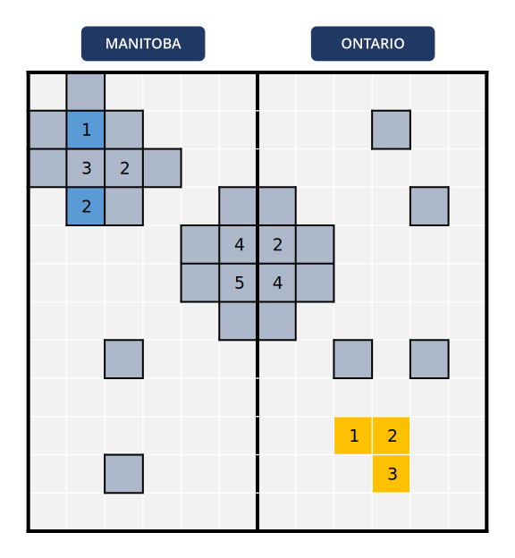
    
<strong>(g) Step 7</strong>

  

  

    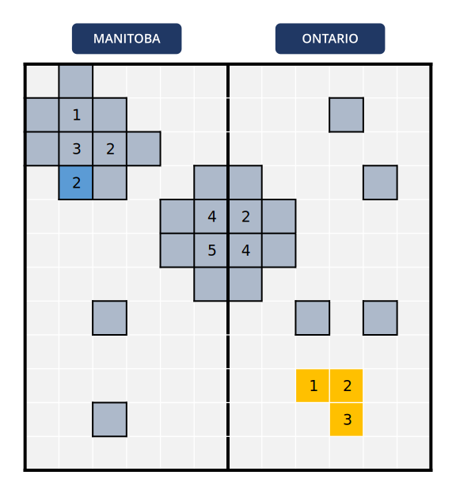
    
<strong>(h) Step 8</strong>

  

  

    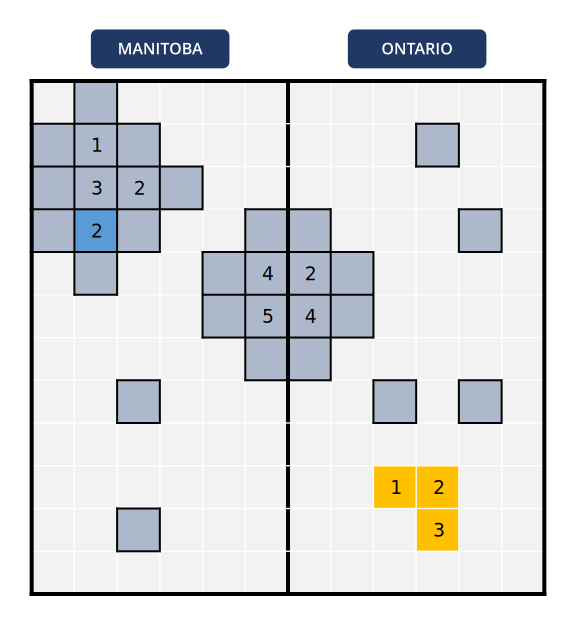
    
<strong>(i) Step 9</strong>

  

  

    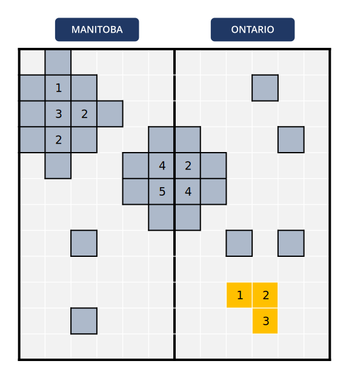
    
<strong>(j) Step 10</strong>

  

**Figure 3:** Applying Adaptive Cluster Sampling